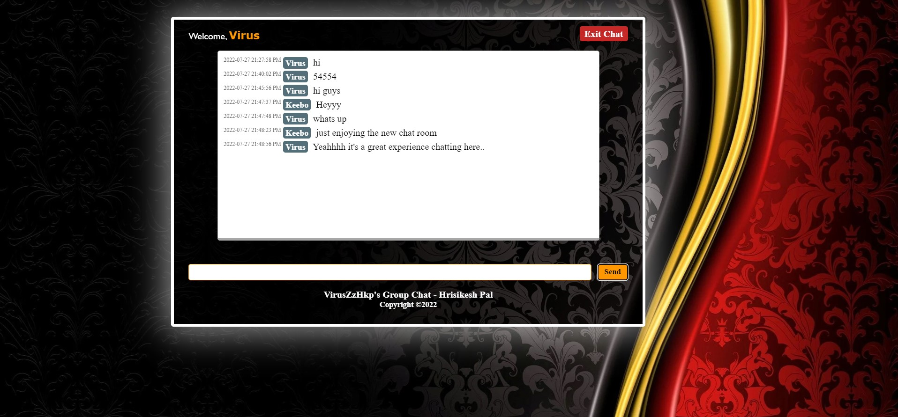

# VirusZzHkP_GroupChat
It is a proper Group Chat Site, where anyone signed-in on the site can chat with others present on site from any corner of the world, and read all messages present there.
Made with php and for database I used Sql.  --VirusZzHkP_GroupChat-v1.0 
<a href="https://hrisikeshpal.000webhostapp.com/">Demo</a>
 
## Front Page

## Chatting Interface

<H3> For detailed knowledge visit my blog page:  </H3>
<a href="https://viruszzwarning.medium.com/"><li>VirusZzWarning</a>
   <H3>Follow my socials:</H3>
 
<a href="https://twitter.com/hrisikesh_pal">Twitter</a> 
<a href="https://www.facebook.com/therealhrisikesh">FB Page</a>
<a href="https://www.linkedin.com/in/viruszzwarning/">LinkedIn</a>
<H4>Donate:</H4>
<a href="https://www.paypal.com/paypalme/hrisikeshpal">PayPal</a> 
<a href="https://www.buymeacoffee.com/hrisikesh">BuyMeACoffee</a>
  
 Cheers!! 
 M@d3 With ♥ -- VirusZzHkP
